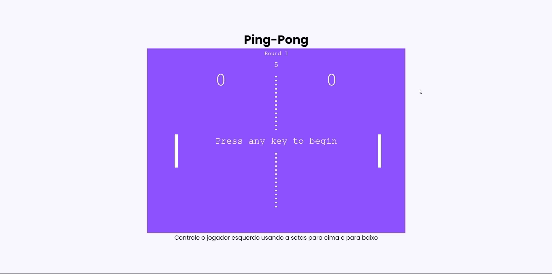

# PING-PONG 

 
 
 - Jogo de Ping-Pong com 5 rounds de até 5 pontos
 - Projeto construído durante o curso PROPROFISSÃO.

## Acesso 👨🏻‍💻
 [Clique aqui para acessar! :)](https://pingpong-fellype.vercel.app/)

## Tecnologias 👾
- HTML
- CSS
- JavaScript
- Git e Github

## Contato
[(LinkedIn)](https://www.linkedin.com/in/fellype-oliveira-920699230/)
-----
fellypeoliveira2020@gmail.com